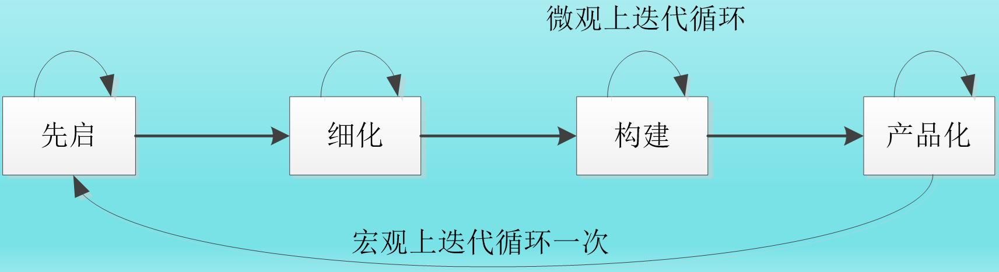

# 软件简述
**软件**是计算机系统中与硬件相对应的另一部分，是一系列**程序**、**数据**及其相关的**文档集合**。
- **程序**是按照特定顺序组织的计算机数据和指令的集合
- **数据**是使程序能正常执行的数据结构
- **文档**是是开发、使用和维护程序所需要的图文资料
**计算机软件的核心是程序**，而文档则是软件不可分割的组成部分。

# 软件定义
软件是能够**完成预定功能和性能**的可执行的计算机程序和使程序正常执行所需要的数据，加上描述程序的操作和使用的文档。

# 软件的特性
## 本质特性
- 复杂特性
- 抽象特性
- 依赖特性
- 使用特性
- 废弃特性
  
  
- 应用特性

## 生产特性
- 软件开发特性
- 软件产品形式特性
- 软件维护特性

# 软件的分类

应用软件主要可分为如下四类：
- 桌面通用(个人)软件
- 企业级软件
- 嵌入式软件
- 云计算软件

# 软件危机

## 软件危机概述

软件危机是指在计算机**软件开发和维护**时所遇到的一系列问题。

## 软件危机产生的原因
- 忽视软件开发前期的需求分析
- 开发过程缺乏统一的、规范化的方法论指导
- 文档资料不齐全或不准确
- 忽视与用户之间、开发组成员之间的交流
- 忽视测试的重要性
- 不重视维护或由于上述原因造成维护工作的困难
- 从事软件开发的专业人员对这个产业的认识不充分，缺乏经验
- 没有完善的质量保证体系

## 软件危机的表现形式
- 软件开发费用和进度失控
- 软件系统实现的功能与实际需求不符
- 软件的可靠性差
- 软件难以维护
- 软件通常没有适当的文档资料
- 软件成本在计算机系统总成本中所占的比例居高不下，且逐年上升
- 软件生产率提高的速度，远远跟不上计算机应用迅速普及深入的趋势

## 消除软件危机的途径
- 使用好的软件开发技术和方法
- 使用好的软件开发工具，提高软件生产率
- 开发过程要有统一的、公认的方法论和规范指导，必须按照规定的方法论进行开发
- 必须在测试阶段充分做好检测工作，给客户提交高质量的软件

# 软件工程

## 软件工程的形成与发展
1. **20世纪70年代**。提出了软件生产工程化的思想、软件生存周期的概念、多种开发模型、方法与多种软件开发工具。
2. **20世纪80年代**。提出软件能力成熟度模型、个体软件过程、群组软件过程等概念。在软件定量研究方面提出了软件工作量估计COCOMO（Constructive Cost Model）模型。软件开发过程从目标管理转向过程管理。
3. **20世纪90年代末**。出现了许多的敏捷方法。
4. **21世纪**。对快速应用开发(Rapid Application Development，RAD)追求的趋势仍在继续。

## 软件工程的定义

软件工程是计算机科学中的一个重要分支，国家标准GB/T 11457--2006《信息技术软件工程术语》对软件工程的定义为：“**软件工程是应用计算机科学理论和技术以及工程管理原则和方法，按预算和进度，实现满足用户要求的软件产品的定义、开发、发布和维护的工程或进行研究的学科。**”

具体来说，软件工程是以借鉴传统工程的原则和方法，以提高质量、降低成本为目的指导计算机软件开发和维护的工程学科。它是一种层次化的技术。

## 软件工程的目标和原则

软件工程要达到的基本目标包括以下六方面：
- 达到要求的软件功能
- 取得较好的软件性能
- 开发出高质量的软件
- 付出较低的开发成本
- 需要较低的维护费用
- 能按时完成开发工作，及时交付使用

1983年，著名软件工程专家B.W.Boehm综合有关专家和学者的意见并根据多年来开发软件的经验，提出了软件工程的七条基本原则。
- 用分阶段的生存周期计划进行严格的项目管理
- 坚持进行阶段评审
- 实行严格的产品控制
- 采用现代程序设计技术
- 软件工程结果应能清楚地审查
- 软件工程结果应能清楚地审查
- 承认不断改进软件工程实践的必要性

## 软件工程知识体系及知识域
软件工程知识体系指南将软件工程知识体系划分为10个知识域，包含在**两类过程**中。
- 一类过程是开发与维护过程，包括软件需求、软件设计、软件构造、软件测试和软件维护
- 另一类过程是支持过程，包括软件配置管理、软件工程管理，软件工程过程、软件工程工具写方法、软件质量。
每个知识域还可进一步分解为若干个论题，在论题描述中引用有关知识的参考文献，形成一个多级层次结构，以此确定软件工程知识体系的内容和边界。

|知识域|子知识域|
|---|---|
|软件需求|软件需求基础、需求过程、需求获取、需求分析、需求规格说明、需求确认、实践考虑|
|软件设计|软件设计基础、软件设计关键问题、软件结构与体系结构、软件设计质量的分析与评价、软件设计记法、软件设计的策略与方法|
|软件构造|软件构造基础、管理构造、实际考虑|
|软件测试|软件测试基础、测试级别、测试技术、与测试相关的度量、测试过程|
|软件维护|软件维护基础、软件维护关键问题、维护过程、维护技术|
|软件配置   管理|软件配置过程管理、软件配置标识、软件配置控制、软件配置状态报告、软件配置审计、软件发行管理和交付|
|软件工程   管理|项目启动和范围定义、软件项目计划、软件项目实施、评审与评价、项目收尾、软件工程度量|
|软件工程   过程|过程定义、过程实践与变更、过程评估、过程和产品度量|
|软件工程工具与方法|软件工具（软件需求工具、软件设计工具、软件构造工具、软件测试工具、软件维护工具、软件配置管理工具、软件工程过程工具、软件质量工具和其他工具问题）、软件工程方法（启发式方法、形式化方法、原型方法）|
|软件质量|软件质量基础、软件质量过程、实践考虑|

软件工程学的主要内容是软件开发技术和软件工程管理。其中，软件开发技术包括软件工程方法学、软件工具和软件开发环境；软件工程管理包括软件工程经济学和软件管理学。

### 软件工程方法学
软件工程方法学是编制软件的系统方法，它确定软件开发的各个阶段，规定每阶段的活动、产品、验收的步骤**三个要素**，分别为**方法**、**工具**和**过程**。其中，方法是完成软件开发任务的技术方法；工具是为方法的运用提供自动或半自动的软件支撑环境；过程规定了完成任务的工作阶段、工作内容、产品、验收的步骤和完成准则。

### 软件工具
软件工具(Software Tools，ST)是指为了支持计算机软件的开发和维护而研制的程序系统。使用软件工具的目的是提高软件设计的质量和生产效率，降低软件开发和维护的成本。

### 软件开发环境
软件开发环境的设计目标是提高软件生产本和改善软件质量。

### 软件工程管理
软件工程管理就是对软件开发各阶段的活动进行管理，其目的是确保按预定的时间和费用，成功地生产出软件产品。

# 软件生存周期
软件生存周期由**软件定义**、**软件开发**和**运行维护(也称为软件维护)** 三个时期组成，每个时期又进一步划分成八个阶段

## 软件定义时期
软件计划时期确定软件开发工程必须完成的总目标；确定工程的可行性；导出实现工程目标应该采用的策略及系统必须完成的功能；估计完成该项工程需要的资源和成本,并且制定工程进度表。分为**问题定义**、**可行性研究**和**需求分析**三个阶段，这个时期的工作通常又称为系统分析，由系统分析员负责完成。

## 软件开发时期
软件开发时期可分为**概要设计**、**详细设计**、**编码和单元测试**、**综合测试**四个阶段组成。其中，前两个阶段又称为系统设计，后两个阶段又称为系统实现。

## 软件维护时期
软件交付使用后，在软件运行过程中，需要不断地进行维护，才能使软件持久地满足用户的需要。具体地说，当软件在使用过程中发现错误时应该加以改正；当环境改变时应该修改软件以适应新的环境；当用户有新要求时应该及时改进软件以满足用户的新需要。通常对维护时期不再进一步划分阶段，但是每一次维护活动本质上都是一次压缩和简化了的定义和开发过程。

## 软件生存周期八个阶段的主要任务
1. **问题定义**。确定系统的目标、规模和基本任务。
2. **可行性研究**。从经济、技术、法律等方面分析确定系统是否值得开发，及时建议停止不值得开发的项目，避免人力、物力和时间的浪费。
3. **需求分析**。确定软件系统应具备的具体功能。通常用数据流图、数据字典和简明算法描述表示系统的逻辑模型，以防止产生系统设计与用户的实际需求不相符的后果。
4. **概要设计**。确定系统设计方案、软件的体系结构。确定软件由哪些模块组成以及这些模块之间的相互关系。
5. **详细设计**。描述应该如何具体地实现系统。详细设计的每个模块应确定实现模块所需要的算法和数据结构。
6. **软件实现和单元测试阶段**。进行程序设计(编码)和单元测试。
7. **综合测试阶段**。通过综合测试过程，查找软件设计中的错误并改正，确保软件质量。同时，还要在用户的参与下进行验收，才可交付使用。
8. **运行维护阶段**。在软件运行期间，通过各种必要的维护，使系统改正错误或修改扩充功能以适应环境变化，从而延长软件的使用寿命，提高软件的效益。每次软件维护的要求及修改过程都应详细准确地记录下来，并作为文档加以保存。

# 软件过程模型

## 瀑布模型
瀑布模型（Waterfall model）一直是唯一被广泛采用的软件生存期模型。瀑布模型是一种基于里程碑的阶段过程模型, 它所提供的里程碑式的工作流程, 为软件项目按规程管理提供了便利，并对提高软件产品质量提供了有效保证。传统软件工程方法学的软件过程，基本上都可以用瀑布模型来描述。

事实上，实际的瀑布模型是带“**反馈环**”的。实线箭头表示开发过程，虚线箭头表示维护过程。当在后面阶段发现前面阶段的错误时，需要沿图中左侧的反馈线返回前面的阶段，修正前面阶段的产品之后再回来继续完成后面阶段的任务。

### 传统瀑布模型的特点
- **软件生存周期的顺序性**。顺序性是指只有前一阶段工作完成以后，后一阶段的工作才能开始；前一阶段的输出文档，就是后一阶段的输入文档。只有在前一阶段有正确的输出时，后一阶段才可能有正确的结果。因而，瀑布模型的特点是由文档驱动。如果在生存周期的某一阶段出现了错误，往往要追溯到在它之前的一些阶段。
- **尽可能推迟软件的编码**。程序设计也称编码。实践表明，大、中型软件的编码阶段开始得越早，完成所需要的时间反而越长。瀑布模型在编码之前安排了需求分析、概要设计、详细设计等阶段，从而把逻辑设计和编码清楚地划分开来，尽可能推迟程序编码阶段，以保证软件开发质量。
- **保证质量**。为了保证质量，瀑布模型坚持两个重要做法。一方面，每个阶段都要完成规定的文档；另一方面，每个阶段都要对已完成的文档进行复审，以便及早发现隐患，排除故障。

### 瀑布模型的优点
- 可强迫开发人员采用规范化的方法
- 严格地规定了每个阶段必须提交的文档
- 要求每个阶段交出的所有产品都必须是经过验证(评审)的

### 瀑布模型的缺点
- 由于瀑布模型几乎完全依赖于书面的规格说明，很可能导致最终开发出的软件产品不能真正满足用户的需要，如果需求规格说明与用户需求之间有差异，就会发生这种情况
- 瀑布模型只适用于项目开始时需求已确定的情况

## 快速原型模型
快速原型模型(Rapid Prototype Model)的基本思想是快速建立一个能反映用户主要需求的原型系统，让用户在计算机上试用它，通过实践来了解目标系统的概貌。

快速原型模型是不带反馈环的。

### 快速原型模型的优点
- 有助于满足用户的真实需求
- 原型系统已经通过与用户的交互而得到验证，据此产生的规格说明文档能够正确地描述用户需求
- 软件产品的开发基本上是按线性顺序进行
- 因为规格说明文档正确地描述了用户需求，所以在开发过程的后续阶段不会因发现规格说明文档的错误而进行较大的返工
- 开发人员通过建立原型系统已经学到了许多东西，因此，在设计和编码阶段发生错误的可能性比较小，这自然减少了在后续阶段需要改正前面阶段所犯错误的可能性
- 快速原型的本质是“快速”。开发人员应该尽可能快地建造出原型系统，以加速软件开发过程，节约软件开发成本。原型的用途是获知用户的真正需求，一旦需求确定了，原型就可以抛弃，当然也可以在原型的基础上进行开发

## 增量模型
增量模型（Incremental model）也称为渐增模型，是Mills等人于1980年提出来的。使用增量模型开发软件时，把软件产品作为一系列的增量构件来设计、编码、集成和测试。每个构件由多个相互作用的模块构成，并且能够完成特定的功能。使用增量模型时，第一个增量构件往往实现软件的基本需求，提供最核心的功能。

每个增量构件应当实现某种系统功能，因此增量构件的开发可以采用瀑布模型的方式。

### 增量模型的优点
- 能够在较短的时间内向用户提交一些有用的工作产品，即从第一个构件交付之日起，用户就能做些有用的工作
- 逐步增加产品的功能可以使用户有较充裕的时间学习和适应新产品，从而减少全新的软件可能给用户、组织带来的冲击
- 项目失败的风险较低，虽然在某些增量构件中可能遇到一些问题，但其他增量构件将能够成功地交付给客户
- 优先级最高的服务首先交付，然后，再将其他增量构件逐次集成进来。一个必然的事实是：最重要的系统服务将接受最多的测试。这意味着系统最重要的部分一般不会遭遇失败
### 采用增量模型需注意的问题 
- 在把每个新的增量构件集成到现有软件体系结构中时，必须不破坏原来已经开发出来的产品
- 软件体系结构必须是开放的，即向现有产品中加入新构件的过程必须简单、方便

## 螺旋模型
在软件开发过程中必须及时识别和分析风险，并且采取适当措施以清除或减少风险的危害。1988年，Boehm最早提出了螺旋模型（Spiral model），**该模型将瀑布模型与快速原型模型结合起来，并且加入两种模型均忽略了的风险分析**。螺旋模型的基本思想是，使用原型及其他方法来尽量降低风险。螺旋模型可以看作是在每个阶段之前都增加了风险分析过程的快速原型模型。

### 螺旋模型的优点 
- 对可选方案和约束条件的强调有利于已有软件的重用，也有助于把软件质量作为软件开发的一个重要目标
- 减少了过多测试或测试不足所带来的风险
- 在螺旋模型中维护只是模型的另一个周期，因此，在维护和开发之间并没有本质区别

### 螺旋模型的缺点
螺旋模型是风险驱动的，因此，要求软件开发人员必须具有丰富的风险评估经验和这方面的专门知识，否则将出现真正的风险，当项目正在走向灾难时，开发人员可能还以为一切正常。

## 喷泉模型

喷泉模型(Fountain Model)是典型的**面向对象软件开发模型**，着重强调不同阶段之间的重叠，认为面向对象的软件开发过程不需要或不应该严格区分不同的开发阶段。

在分析阶段，定义类和对象之间的关系，建立对象-关系和对象-行为模型。在设计阶段，从实现的角度对分析阶段模型进行修改或扩展。在编码阶段，使用面向对象的编程语言和方法实现设计模型。在面向对象的方法中，分析模型和设计模型采用相同的符号标示体系，各阶段之间没有明显的界限，而且常常重复、迭代地进行。

## 统一软件开发过程模型
统一软件开发过程（Rational Unified Process，RUP）模型是基于**统一建模语言（Unified Modeling Language，UML）** 的一种面向对象软件开发模型。它解决了螺旋模型的可操作性问题，采用迭代和增量递进的开发策略，并以用例驱动为特点，集中了多个软件开发模型的优点。RUP模型是迭代模型的一种。

基于统一软件开发过程模型所构造的软件系统，是由软件构件建造而成的。这些软件构件定义了明确的接口，相互连接成整个系统。在构造软件系统时，RUP采用架构优先的策略。软件架构概念包含了系统中最重要的静态结构和动态特征，架构体现了系统的总体设计。架构优先开发的原则是RUP开发过程中至关重要的主题。
统一软件开发过程模型适用的范围极为广泛，但是对开发人员的素质要求较高。

## 基于构件的开发模型
基于构件的开发是指利用预先包装的构件来构造应用系统。构件可以是组织内部开发的，也可以是现有的商业成品构件（Commercial Off-The-Shelf，COTS）。基于构件的软件工程(Component Based  Software Engineering，CBSE)强调使用可复用的软件“构件”来设计和构造基于计算机系统。

基于构件的开发模型中，需求分析与设计建模活动开始于识别可选构件，这些构件有些设计成通用的软件模块，有些设计成面向对象的类或软件包。不考虑构件的开发技术。

### 基于构件的开发模型的步骤
- 对该问题领域的基于构件的可用产品进行研究和评估
- 考虑构件集成的问题
- 设计软件体系结构(或称架构)以容纳这些构件
- 将构件集成到体系结构中
- 进行充分的测试以保证功能正常

## 敏捷软件开发模型

### 敏捷过程概述
敏捷开发开始于“敏捷软件开发宣言”。在2001年2月，17位软件开发方法学家在美国犹他州召开了长达两天的会议，制定并签署了“敏捷软件开发宣言”，该宣言给出了四个价值观：
- 个体与交互高于过程和工具
- 可运行软件高于详尽的文档
- 与客户协作高于合同(契约)谈判
- 对变更及时响应高于遵循计划

### 极限编程
极限编程是一种实践性较强的、规范化的软件开发方法，它强调用户需求和团队工作。
极限编程包含了一组相互作用和相互影响的规则和实践。

首先，项目组针对客户代表提出的“用户故事”（用户故事类似于用例，但比用例更简单，通常仅描述功能需求），进行讨论，提出隐喻，在此项活动中可能需要对体系结构进行“试探”，所谓试探就是提出相关技术难点的试探性解决方案。然后，项目组在隐喻和用户故事的基础上，根据客户设定的优先级制订交付计划(为了制订出切实可行的交付计划，可能需要对某些技术难点进行试探)。接下来开始多个迭代过程(通常每个迭代历时1-3周)，在迭代期内产生的新用户故事不在本次迭代内解决，以保证本次开发过程不受干扰。开发出的新版本软件通过验收测试之后交付用户使用。

## 几种模型之间的关系

### 瀑布模型与RUP模型之间的关系
在宏观上，瀑布模型是静态模型，RUP模型(RUP型是迭代模型的一种)是动态模型。RUP模型的每一次迭代，实际上都需要执行一次瀑布模型，都要经历先启、细化、构建和产品化这四个阶段，完成瀑布模型的整个过程。
在微观上，瀑布模型与RUP模型都是动态模型。瀑布模型与RUP模型在每一个开发阶段(先启、细化、构建、产品化)的内部都需要有一个小小的迭代过程，只有进行这样的迭代，开发阶段才能做得更好。

### 瀑布模型与增量模型之间的关系
增量模型是把待开发的软件系统模块化，将每个模块作为一个增量组件，一个模块接着一个模块地进行开发，直到开发完所有的模块。
在开发每个模块时，通常都是采用瀑布模型，从分析、设计、编码和测试这几个阶段进行开发。所以，增量模型中有瀑布模型，即宏观上是增量模型，微观上是瀑布模型。
增量模型也体现了迭代思想，每增加一个模块，就进行一次迭代，执行一次瀑布模型。因此，增量模型本质上是迭代的。

### 瀑布模型与快速原型模型之间的关系
快速原型模型的基本思想是快速建一个能反映用户主要需求的原型系统，在此基础上之后的每次迭代，都可能会用到瀑布模型。
快速原型模型中不但包含了迭代模型的思想，而且包含了瀑布模型的思想。

### 瀑布模型与螺旋模型之间的关系
螺旋模型是瀑布模型和快速原型模型的结合，快速原型模型是原型模型的简化，原型模型又是迭代模型和瀑布模型的组合，这些模型之间是相互依存的、彼此有关的。
螺旋模型每次顺时针方向旋转，相当于顺时针方向迭代一次，都是走完一次瀑布模型，这就是瀑布模型与螺旋模型之间的关系。实际上，瀑布模型与喷泉模型也有关系。

## 软件过程模型的选择

### 软件过程模型选择需要考虑的因素
- 符合软件自身的特性，如规模、成本和复杂性等
- 满足软件开发进度的要求
- 对软件开发的风险进行预防和控制
- 具有计算机辅助工具的支持
- 与用户和软件开发人员的知识和技能相匹配
- 有利于软件开发的管理和控制

### 选择实例

例1：针对下面这些应用开发软件，应采用哪种软件过程模型？要求说明原因。
- 已经充分了解了的数据处理应用程序。
解：应选用瀑布模型。
原因：在软件开发的过程中，需求不发生或很少发生变化，并且开发人员可以一次性获取全部需求；软件项目的风险较低；开发者对软件应用领域很熟悉。

例2：针对下面这些应用开发软件，应采用哪种软件过程模型？要求说明原因。
通过卫星通信连接计算机的新软件产品，假设之前没有开发卫星通信软件的经验。
解：应选用螺旋模型。
原因：没有相应的开发经验，风险较大，螺旋模型明确包括了开发的每一阶段中的风险处理，在每一次迭代中，风险分析通过原型构建进行，允许对处理风险可用的不同选项进行权衡。

例3：假设计划研发一种产品技术含量很高，与客户有关的风险也很多，你会采用哪种软件过程模型？请说明理由。  解：采用RUP模型。RUP模型在每个步骤后都会形成一个可以发布的产品，这个产品是最终产品的一个子集。这样能够在生存周期中尽早地避免风险，不会像其他过程模型样，有可能直到最后才发现，而临巨大风险。再者这个模型能产生多个软件样品，每个样品实现某个个别功能，一一解决软件开发中的难点，最终产生拥有高技术含量的成品。
由于考虑问题的角度不同，答案也许不是唯一的。

# 软件工程发展趋势
软件工程作为信息技术的核心之一，其发展趋势和前景影响了我国信息技术产业的发展。结合国内软件工程技术的发展程度及社会发展需求，软件工程技术发展趋势表现为**全球化**、**开放化**、**模块化**。

## 全球化趋势
经济发展正在全球化，政治治理也在全球化的进程当中。全球化是当今社会发展的必然趋势，软件工程技术的发展也无法逃离全球化的漩涡。就目前软件工程的发展现状而言，国外的技术更为成熟。因此，我国软件工程技术的发展，必然要加强与国外成功企业进行合作交流。故软件工程技术发展的全球化趋势和特点会更加突出。而全球化的趋势之于我国信息产业是机遇，但同时也带来了诸多挑战。与国外成功企业的合作交流，我国企业能够学习到其中优秀的管理办法和经验，以及优秀的鼓励员工进行创新的企业文化和氛围。但同时，也会存在诸如核心技术的保护等问题。因此，我国企业面临机遇，同时也要做好相应的工作，提高应对挑战的能力。

## 开放化趋势
随着全球化趋势的不断加强，软件工程技术的发展趋势必然也会表现为开放化。使不同企业开发的软件可以相互融合，取长补短，共同开发出一个更加完善的软件，促进软件的更新换代，使用一种开放的里面来促进软件工程的发展。例如，目前流行的共享单车，它和支付宝、微信等平台相互联系。支付宝利用共享单车吸引更多的人使用支付宝，并且完善支付宝、微信平台上的应用，而共享单车则利用支付宝、微信平台的收款功能。这些软件相互促进，取长补短，共同进步，也促进软件工程技术的发展。因此，未来的软件工程将会有一个开放化的发展空间，国家与国家之间也会相互促进，共同发展。同时，在不断扩大开放化趋势的同时，软件工程发开人员也能更容易地发现目前正在运行的软件存在的不足和缺陷，进而采用更为便捷的方式对其进行修复和修改。

## 模块化趋势
软件工程模块化设计思想是将复杂庞大的系统进行分解，划分为若干个子系统，各个子系统具有独立的运转功能，并具有多种接口，增强了子系统的通用性。若系统需要升级，只需更换相应的模块，而不需要进行整体更换，增强了系统的可扩展性。模块化的最大优点是使开发者专注于某一功能的开发，提高专业性的同时，缩短了研发时间和研发成本。这种模块化的技术方式顺应的社会的发展趋势，有效解决IT环境所面临的复杂程度和历史遗留问题，加强软件工程的社会竞争力，增加企业自身的优势。