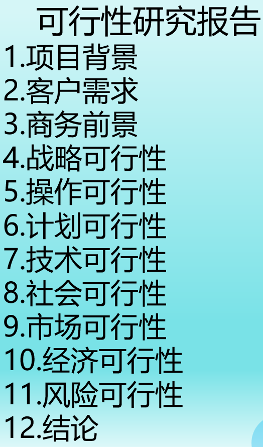
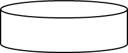
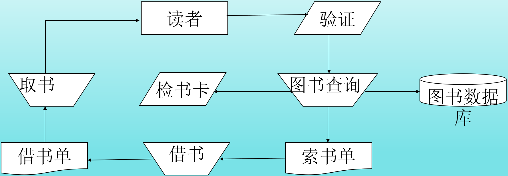
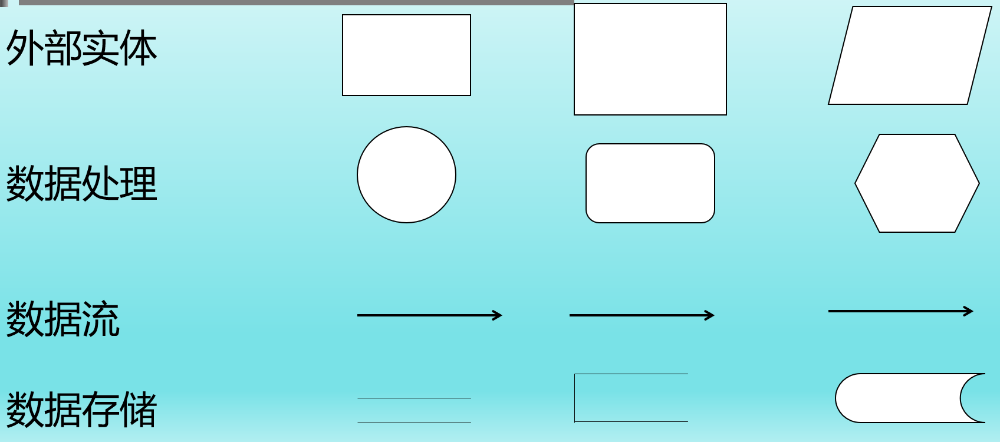
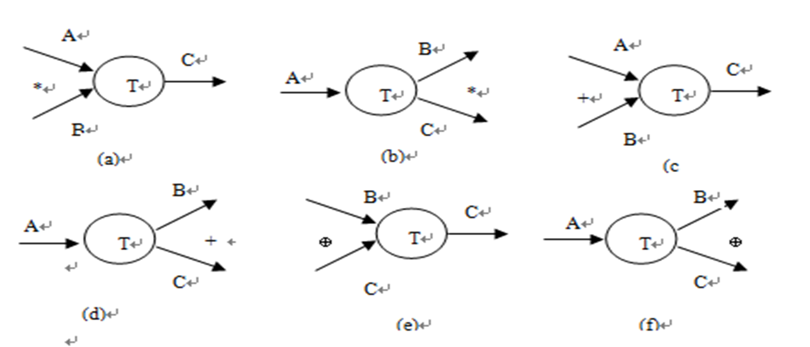
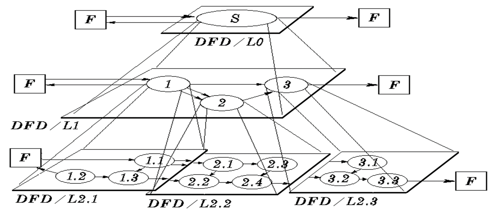

# 软件问题定义
在软件工程项目开始时，先进行系统定义，它是整个工程的基础。**系统定义**所涉及的问题不完全属于软件工程的范畴，它为系统提供总体概貌，确定系统硬件、软件的功能和接口，它的主要任务具体表现为如下三个方面：
- 充分理解所涉及的问题，对问题的解决办法进行论证
- 评价解决办法的不同实现方案
- 表达解决方案，以便进行复审
系统定义后，软件的功能初步确定，接下来要进行**软件问题定义**、**可行性研究**、**制定软件开发计划**和**复审**。
问题定义和可行性研究这两个阶段的主要任务就是分析用户要求，在对用户要求充分了解的前提下，分析新系统（即目标系统）的主要目标，分析开发系统的可行性。
参加这个时期工作的人员有用户和系统分析员。
通过对用户进行详细的调查研究，仔细阅读和分析有关资料，明确所开发的软件系统的名称，该软件系统同其他系统或其他软件之间的相互关系，明确系统的目标、规模和基本要求，并对现有系统进行分析，明确开发新系统的必要性。

## 明确系统的目标、规模和基本要求
在调查研究的基础上，弄清拟开发软件的基本要求、目标、假定、限制、可行性研究的方法、评价尺度等。
- **基本要求**。包括软件的功能、性能、输入（数据的来源、类型、数量，数据的组织以及提供的频度）、输出（如报告、文件或数据，说明其用途、产生频度、接口及分发对象）、处理流程和数据流程、安全和保密方面的要求、同本系统相连接的其他系统等
- **系统目标**。例如，人力与设备费用的减少；处理速度的提高；控制精度或生产能力的提高；管理信息服务的改进；人员利用率的改进等
- **系统开发的条件、假定和限制**。例如，系统运行寿命的最小值；经费、投资的来源和限制，法律和政策的限制；硬件、软件、运行环境和开发环境的条件及限制；可利用的信息和资源；完成期限等
- **可行性研究的方法**。可采用调查、加权、确定模型、建立基准点或仿真等方法进行可行性研究
- **评价尺度**。例如，经费的多少，各项功能的优先次序，开发时间的长短及使用的难易程度等。

## 问题定义的方法
在**问题定义**阶段，需要用户和系统分析员共同协作、紧密配合，方能圆满地完成问题定义报告。具体步骤如下：
1. 系统分析员要针对用户的要求做详细的调查研究，认真听取用户对问题的介绍，阅读与问题有关的资料，必要时还要深入现场，亲自操作；调查开发系统的背景；了解用户对开发的要求
2. 与用户反复讨论，以使问题进一步确定化。经过用户和系统分析员充分协商，确定问题定义的内容

## 设计新系统可能的解决方案
- 系统分析员在分析现有系统的基础上，针对新系统的开发目标，设计出新系统的若干种高层次的可能解法
- 可以用高层数据流图和数据字典来描述系统的基本功能和处理流程
- 先从**技术**的角度出发提出不同的解决方案，再从**经济可行性**和**操作可行性**进行考虑，优化和推荐方案，最后要将上述分析设计结果整理成文档，供用户方的决策者选择
- 现在尚未进入需求分析阶段，对系统的描述不是完整的、详细的，只是概括的、高层的
- 最后写出双方均认可的问题定义报告。

例2.1: 某高校教务处提出用微机管理教务工作的要求，经过系统分析员的调查研究并与用户协商，写出了如下问题定义报告。
解：某高校教务管理系统问题定义报告如下：

系统目标和范围说明书
1. 项目名称：XX学院教务管理系统。
2. 背景：目前教务人工管理，效率低，易出错。
3. 项目目标：在网络上建立一个高性能的、无差错的教务管理系统。
4. 项目范围：利用现有的校园网，教务处及各系均配备一台专用微机，软件开发费用不超过１万元。
5. 初步设想：在网上实现上报各种信息（学生成绩、教师课时费等）、排课、下通知等功能。

# 可行性研究的任务

## 技术可行性
技术可行性是指**对设备条件、技术解决方案的实用性和技术资源的可用性的度量**。在决定采用何种开发方法和工具时，必须考虑设备条件，通常选择实用的、开发人员掌握较好的一类；还要考虑用户使用可行性和操作可行性。其中，用户使用可行性是指使用软件对用户内部组织管理制度的影响程度；用户操作可行性是指软件系统所采用的操作方式对用户来说是否可行。

## 经济可行性
经济可行性是指**以最小的成本开发出具有最佳经济效益的软件产品**。
它主要进行投资及效益分析，内容如下：
- 支出。说明所需的费用，包括基本建设投资，移动设备和固定设备购置费用，操作系统、应用软件、网络软件和数据库管理软件费用，其他一次性支出及非一次性支出费用。
- 收益。包括开支的减少，速度的提高和管理方面的改进，一次性收益、价值的增加、非一次性收益、不可定量的收益等。
- 收益／投资比。
- 投资回收周期（一般假定为５年）。
- 敏感度分析。

## 社会因素方面的可行性
社会因素方面的可行性主要从**法律**、**用户**等方面分析可行性，其中，法律方面的可行性是指要开发的项目是否存在任何侵权，妨碍等责任问题；用户方面的可行性是指对用户内部组织管理制度的影响程度，用户操作方式是否可行等。

## 操作可行性
要考虑开发项目的运行方式在用户组织内是否行得通，现有管理制度、人员素质和操作方式是否可行。
可行性研究要在分析的基础写出书面报告《可行性论证报告》。可行性分析必须有一个明确的结论。可行性研究结论可能会是下列情形之一。
- 可以进行开发
- 需要等待某些条件（例如资金、人力、设备等）落实之后才能开发；或需要对开发目标进行某些修改之后才能开发
- 不能进行或不必进行开发（例如所需技术不成熟、经济上不划算等）
可行性研究阶段不要急于着手解决问题，其主要目的是得到系统确实可行的结论，或及时中止不可行的项目。可行性报告要得到用户单位决策者的认可，所提出的结论要有具体、充分的理由。由用户单位的决策者根据可行性报告，从分析员推荐解决方案中选择决定所采用的具体解决方案；如果问题没有可行的解，及时中止不值得投资的工程项目，避免时间、资源、人力和金钱上更大的浪费。

# 可行性研究的步骤
在可行性研究时，根据**项目的性质、特点**及**开发团队的能力**进行开发，可行性研究的步骤不是固化的，一般可归结为以下八个步骤。

## 系统定义
系统定义是一个系统的关键，如果系统没有定义好，也就是没有确定系统的边界，就谈不上确定规模和目标。
可行性分析人员要访问相关人员，阅读分析可以掌握的材料，确认用户需要解决的问题实质，对项目的规模和目标进行定义和确认，描述项目的一切限制和约束，进而明确系统的目标及为了达到这些目标系统所需的各种资源。

## 对现行系统进行分析研究
现行系统是信息的重要来源，需要研究它的基本功能、性能、环境、存在的问题，以及运行现行系统需要多少费用，对新系统有什么新的功能要求，新系统运行时能否减少使用费用等。
具体方法可以实地考察现行系统，收集、研究和分析现行系统的文档资料，分析员应该画出描绘现有系统的高层系统流程图，系统数据流分析和业务流程紧密相连，可以用数据流图和数据字典来表示，并请有关人员检验他对现有系统的认识是否正确。

## 导出新系统的逻辑摸型
根据对现行系统的分析研究，导出现有系统的逻辑模型，设想目标系统的逻辑模型，最后根据目标系统的逻辑模型建造新的物理模型。用建立逻辑模型的工具数据流图和数据字典描绘数据在系统中流动和处理的情况，从而概括地表达出对新系统的设想。

## 设计方案
新系统的逻辑模型实质上表达了分析员对新系统必须做什么的看法。用户是否也有同样的看法呢？分析员应该和用户一起再次复查问题定义、工程规模和目标，这次复查应该把数据流图和数据字典作为讨论的基础。如果分析员对问题有误解或者用户曾经遗漏了某些要求，那么现在是发现和改正这些错误的时候了。
分析员定义问题，分析这个问题，导出一个试探性的解；在此基础上再次定义问题，再一次分析这个问题，修改这个解；继续这个循环过程，直到提出的逻辑模型完全符合系统目标。

## 推荐可行的方案
分析员应该从他建议的系统逻辑模型出发，导出若干个较高层次的(较抽象的)物理解法供比较和选择。导出供选择的解法的最简单的途径，是从技术角度出发考虑解决问题的不同方案。当从技术角度提出一些可能的物理系统之后，应该根据技术可行性的考虑初步排除一些不现实的系统。
**操作可行性方面**，分析员应该根据使用部门处理事务的原则和习惯检查技术上可行的那些方案，去掉其中从操作方式或操作过程的角度看用户不能接受的方案。
**经济可行性方面**，分析员应该估计余下的每个可能的系统的开发成本和运行费用，并且估计相对于现有的系统而言这个系统可以节省的开支或可以增加的收入。在这些估计数字的基础上，对每个可能的系统进行成本/效益分析，只有投资预计能带来利润的系统才值得进步考虑。
根据技术可行性、经济可行性、社会可行性和操作可行性等方面对各种方案进行评估，去掉行不通的解法，得到可行的解法。

## 推荐行动方针
在对上一步提出的各种方案分析比较的基础上，分析员向用户推荐一种最好的方案，并且说明选择此解决方案的理由，在推荐方案中应清楚地表明。
- 本项目的开发价值
- 推荐这个方案的理由
- 制定实现进度表，这个进度表不需要也不可能很详细，通常只需要估计生存周期每个阶段的工作量

## 草拟开发计划
分析员应该为所推荐的方案草拟一份开发计划，除了制定工程进度表之外还应该估计对各类开发人员(例如：系统分析员、程序员) 和各种资源(计算机硬件、软件工具等)的需要情况，应该指明什么时候使用以及使用多长时间。此外还应该估计系统生存周期每个阶段的成本。

## 编写可行性研究报告
此报告包括项目简介、可行性分析过程和结论等内容：

- 要求、目的、条件与限制、可行性研究方法及评价尺度
- 处理流程、工作负荷、费用开销和局限性
- 处理流程、运行环境和局限性
- 技术条件的可行性
- 经济方面的可行性
- 社会条件的可行性
- 其他可供选择的系统
- 结论的顺序写成可行性研究报告。
提请用户和使用部门仔细审查，从而决定该项目是否进行开发，是否接受可行的实现方案。

# 系统流程图

## 系统流程图的作用
用系统流程图来描述物理系统，也就是一个单位、组织的信息处理的具体实现的系统。在可行性研究中，对于旧系统的理解和新系统的构想，可以通过画出系统流程图来表示要开发项目的大概处理流程、范围和功能等，系统流程图不仅能用于可行性研究，还能用于需求分析阶段。
系统流程图是由一系列图形符号组成。系统研究初期，项目负责人要制定一个系统标准。标准中规定了各种符号所代表的含义。在画系统流程图时，首先要搞清业务处理过程以及处理中的各个元素，同时要理解系统流程图的各个符号的含义，选择相应的符号来代表系统中的各个元素。所画的系统流程要反映出系统的处理流程。
在可行性研究过程中，现行系统的高层逻辑模型一般是用概括的形式描述，并通过概要设计变成所建议系统的物理模型。概要设计和建议系统的物理模型都可以用系统流程图来描述。

## 系统流程图的基本内容
- 用图形符号以黑盒子形式描述系统内的每一个成分(例如：程序、文件、数据库、硬件设备、人工过程等)。
- 用“→”表示信息在系统各个成分之间的流动情况（不要误认为“→”表示信息的加工和控制过程）

## 系统流程图的符号
它表达了系统中各个元素之间的信息流动的情况。

|符号|名称|说明|
|-|-|-|
||处理|能改变数据值或位置的加工，例如，程序模块、处理机等都是处理|
||输入/输出|表示输入或输出，是一个广义的不指明具体设备的符号|
||连接|指出转到图的另一部分或从图的另一部分转过来，通常在同一页|
||换页连接|指出转到另一页图上或由另一页图转来|
||数据流|用来连接其他符号，指明数据流动方向|
||文档|通常表示打印输出，也可表示用打印终端输入数据|
||联机存储|表示任何种类的联机存储，包括磁盘，软盘和海量存储器件等|
||磁盘|磁盘输入/输出，也可表示存储在磁盘上的文件或数据库|
||显示|CRT终端或类似的显示部件，可用于输入或输出，也可既输入又输出|
||人工输入|人工输入数据的脱机处理，例如填写表格|
||人工操作|人工完成的处理，例如，会计在工资支票上签名|
||辅助操作|使用设备进行的脱机操作|
||通信链接|通过远程通信线路或链路传送数据|

例2.2：某图书馆借书流程如图所示，读者须先被验明证件后才能进入查询室。读者在查询室内通过检书卡或利用终端检索图书数据库来查找自己所需的图书。找到所需图书并填好索书单后到服务台借书。如果所借图书还有剩余，管理员将填好借书单，从库房中取出图书交给读者。如图所示的系统流程图描述了上述系统的概貌。图中的每个符号定义了组成系统的一个部件，而并没有指明每个部件的具体工作过程。图中的箭头指定了系统中信息的流动路径。

对于复杂的系统，一个比较好的方法是分层次地描绘这个系统。首先用一张高层次的系统流程图描绘系统总体概貌，表明系统的关键功能。然后分别把每个关键功能扩展到适当的详细程度，画在单独的一页纸上。这种分层次的描绘方法便于阅读者按从抽象到具体的过程逐步深入地了解一个复杂的系统。

# 数据流图
当数据在软件系统中移动时，它将被一系列“变换”修改。**数据流图(Data Flow Diagram，DFD)是一种图形化建模工具，也是结构化分析的最基本的工具。** 它描述系统由哪几部分组成，各部分之间有什么联系以及描绘信息流和数据从输入移动到输出的过程中所经历的变换。在数据流图中没有任何具体的物理部件，它只是描绘数据在软件中流动和被处理的逻辑过程，是软件系统逻辑功能的图形表示。在设计数据流图时只需要考虑系统必须完成的基本逻辑功能，完全不需要考虑怎样具体地实现这些功能，所以数据流图也是今后进行软件设计的很好的出发点。

## 数据流图的表示符号

### 数据流图的4种基本符号
数据流图的基本符号如图2.3所示有三种不同的表示方法，归纳起来数据流图只有４种基本符号元素，数据流(Data Flow)､数据处理(Process)､数据存储(Data Store)和外部实体(External Entity) ｡

#### 数据流
用**箭头**表示数据流，箭头方向表示数据流向，数据流名标在数据流线上。数据流由一组数据项组成，但在数据流图中只有其名称。所以，应尽量准确地给数据流命名。
数据流是沿箭头传送数据的通道，是描绘数据流图中各种成分的接口。数据流的方向从加工流向加工，从加工流向数据存储，从数据存储流向加工、从源点流向加工或从加工流向终点。
- 数据流是一组成分已知的信息包，信息包中可以有一个或多个已知信息
- 两个加工间可以有多个数据流
- 数据流应有良好的名字，便于进一步地了解系统
- 同一数据流可以流向不同的加工，不同加工可以流出相同的流（合并与分解）
- 流入或流出到存储的数据流不需要命名，因为数据存储的名字已经有足够的信息来表达数据的意义
- 数据流不代表控制流。数据流反映了处理的对象，控制流是一种选择或用来影响加工的性质，而不是对它进行加工的对象。

#### 加工
加工也称为数据处理，或称为变换，是**对数据进行处理的单元**。数据处理名称写在方框内。它对数据流进行某些操作或变换，每个加工也要有名字，通常是动词短语，简明地描述完成什么加工。在分层的数据流图中，加工还应编号。

#### 数据存储
数据存储是由若干数据元素组成的，它为数据处理提供数据处理所需要的输入流或为数据处理的输出数据流提供储存“仓库”。
数据存储在数据流中起保存数据的作用，可以是数据库文件或任何形式的数据组织、可以表示文件、文件的一部分、数据库的元素或记录的一部分等。在数据流图中要注意指向数据文件的箭头的方向，读数据的箭头是指向加工处理的，写数据的箭头是指向数据存储的，如果既有读又有写，则是双向箭头。

#### 数据源点和终点
数据源点和终点是数据的始发点和终止点，表示系统和环境的接口，是软件系统外部环境中的实体（包括人员、组织或其他软件系统），统称外部实体，其作用是提供系统和外界环境之间关系的注释性说明。它们是为了帮助理解系统界面而引入的，一般只出现在数据流图的顶层图中，表示了系统中数据的来源和去处，不需要对它进行软件设计和实现。因此，在命名时应符合环境的真实状况。
有时为了增加数据流图的清晰性，防止数据流的箭头线太长，在一张图上可重复画同名的源/终点（如某个外部实体既是源点也是终点的情况）。

### 数据流图的几种附加符号
在数据流图中，如果有两个以上数据流指向一个加工，或从一个加工中引出两个以上的数据流，这些数据流之间存在一定的关系。在图2.4中给出描述这些关系所用符号及其含义。

(a)数据A和数据B同时输入时才能转换成数据C
(b)数据A转换成数据B和数据C
(c)数据A或数据B,也可以是数据A和数据B两者转换成数据C
(d)数据A转换成数据B或数据C,也可是数据B和数据C两者
(e)只有数据A或只有数据B转换成数据C
(f)数据A转换成数据B或数据C两者之一
其中：
- `*`表示相邻两个数据流之间是“与”的关系(同时出现)
- `+`表示相邻两个数据流之间是“或”的关系
- `⊕`表示相邻两个数据流只能选取其中一个(互斥关系)

## 设计数据流图的步骤
**数据流图的基本要点是描述“做什么”，而不考虑“怎么做”。** 通常数据流图要忽略出错处理，也不包括诸如打开文件和关闭文件之类的内部处理。绘制数据流图的原则是由外向里，自顶向下描述问题的处理过程，通过一系列的分解步骤，逐步求精地表达出整个系统功能的内部关系。

1. **找出系统的输入和输出**。把整个系统看作一个大的加工，然后根据系统从外界的哪些源接收什么数据流，以及系统输出的哪些数据流送到外界的哪些终点，就可以画出软件系统顶层数据流图。
2. **画系统内部**。将顶层数据流图中的加工分解成若干个加工，并用数据流将这些加工连接起来，使得图中的输入数据流经一连串的加工处理后变换成顶层的输出数据流。从一个加工画出一张数据流图的过程，就是对这个加工的分解过程。确定数据流的方法是：当用户把若干数据看作一个整体来处理（这些数据一起到达，一起加工）时，可把这些数据看成一个数据流。通常可以把实际工作中的单据作为一个数据流。
3. **为每一个数据流命名**。数据流命名的好坏与数据流图的可理解性密切相关。名字要**反映整个数据流的含义**，而不是其中的一部分。避免使用空洞的名字，如“输入信息”、“输出数据”等不能反映实质性内容的名字。
4. **为加工命名**。一般先命名数据流，在命名加工，这个次序反映了结构化分析方法的自顶向下的特性。命名应注意名字要反映整个加工，而不是它的一部分。名字应当是一种“动词＋宾语”的形式。

## 数据流图的层次结构

### 分层
按照系统的层次结构进行逐步分解。
在多层数据流图中，顶层数据流图仅包含1个加工，它代表被开发系统。**它的输入流是该系统的输入数据，输出流是系统所输出的数据**。底层流图是指其加工不需再做分解的数据流图。中间层流图则表示对其上层父图的细化，它的每一个加工可能继续细化，形成子图。

### 分层的原则
- **父图与子图的关系**。对任一层数据流图来说，称其上层图为它的父图，其下层图为它的子图。要注意平衡相邻两层数据流图之间的父子关系。子图代表了父图中某个加工的细节，父图表示了子图之间的接口，两者代表了同一个内容。
- **平衡规则**。子图的输入/输出数据流和父图的相应加工上的输入/输出数据流必须一致。
- **分层程度（即底层数据流图的确定）**。一般一张数据流图中加工最多不要超过7±2个，这样才不会因为加工过多而使人眼花缭乱。但分解应力求自然，保证分解后各界面清晰，意义明确。当底层加工的说明能在一页纸上写下时，分解细化即可停止。

# 数据字典
数据字典(Data Dictionary, DD) 是**结构化分析的另一种有力的工具**。数据流图描述了系统的分解，但没有对图中各个成分进行说明。**数据字典是为数据流图中的每个数据流、数据存储、数据处理以及组成数据流或文件的数据项做出说明。**
数据字典的作用是在软件分析和设计过程提供数据描述，是数据流必不可少的辅助资料。**数据流**和**数据字典**共同构成系统的逻辑模型，两者缺一不可。

## 数据字典的内容
数据字典是关于数据信息的集合，是数据流图中所有元素的定义的集合（每个元素对应数据典中的一个条目）。数据字典中的条目应按一定次序排列，以方便人们查阅。
数据字典通常由**数据元素**、**数据流**、**数据存储**、**数据处理**4类条目组成。
- 数据元素（数据项）
数据的最小组成单位，它包含以下内容：
  - 数据元素的名称、编号，如学号、准考证号
  - 数据元素的别名
  - 数据元素的取值范围和取值含义
  - 数据元素的长度定义，应便于定义数据库结构。例如，考生成绩规定为5位，小数点后取1位小数，小数点占一位，整数部分取3位
  - 数据元素的简单描述；
- 数据流：主要包括数据流的来源、去处、组成数据流的数据项、数据流的流通量。
- 数据存储：描述文件的结构及数据文件中记录的存取规则。
- 数据处理：数据字典中可以描述数据处理的逻辑功能计算法，如计算公式、简明的处理描述等。
在数据字典中，通常采用以下符号表示系统中使用数据项的情况，以及数据项之间的相互关系。
- `=`：表示“等价于”或“定义为”。
- `+`：表示“和”，连接两个数据元素。
- `[]`：表示“或”，对`[]`中列举的各数据元素，用“`|`”分隔，表示可任选其中某一项。例如，储户到银行存款时，可选择存款期限为活期、半年期、1年期、3年期或5年期中的某一种，可表示为存款期限=`[活期半年|1年|3年|5年]`。
- `{}`:表示“重复”，对`{}`中的内容可重复使用。
- `()`:表示“可选”，对`()`中的内容可选、可不选，各选项之间用“，”号隔开。
如果要对`{}`表示的重复次数加以限制，可将重复次数的下限和上限写在花括号的左右（或在花括号左边分别用下角标和上角标表示）。
例如，成绩单=准考证号+姓名+1{课程名+成绩}3，表示最少有1门、最多有3门课程的考试成绩。也可写为：成绩单=准考证号+姓名+31{课程名+成绩}。
特别地，`1{A}`表示A的内容至少要出现1次；`{B}`表示B的内容允许重复零至任意次。

实现数据字典的常见方法有3种：全人工过程、全自动过程和混合过程。全自动过程一般依赖于数据字典处理软件。混合过程是指利用已有的实用程序（例如，正文编辑程序或报告生成程序等）来辅助人工过程。
无论用哪种方法来实现，数据字典应具有以下特点：
- 通过名字能方便地查阅数据定义
- 没有冗余，尽量不重复在规格说明的其他组成部分中已出现的信息
- 容易修改和更新
- 能单独处理描述每个数据元素的信息
- 定义的书写方法简便而严格

# 成本—效益分析
系统效益包括经济效益和社会效益。前者是有形的，后者是无形的。**成本效益分析的目的是从经济角度评价开发一个新的软件项目是否可行。** 成本-效益分析首先是估算将要开发系统的开发成本，然后与可能取得的效益进行比较和权衡，效益分有形效益和无形效益两种。有形效益可以用货币的时间价值、投资回收期和纯收入等指标进行度量；无形效益主要从性质上、心理上进行衡量，很难直接进行量的比较。
**一个软件开发的成本主要表现在人力和时间的消耗。** 工作量是指在软件项目建设过程中需要投入的人力和时间，一般用人月数进行度量。项目的建设分为开发阶段、实施阶段、运行维护阶段。故工作量需要分阶段进行估算。工作量=开发工作量+实施工作量+维护工作量。由于这种消耗估计不是精确的科学计算，因此可以用几种方法计算后相互验证。

## 代码行定量估算方法
开发软件中实现每一个功能所需要的源代码行数与成本联系起来。根据历史数据和经验，估计实现一个功能需要的源程序行数。当有了源程序的行数后，再根据软件的复杂度和当时的工资水平确定每行代码的平均成本。**每行代码的平均成本与源程序的总行数的乘积就是总成本。** 如果以往开发过类似的项目或有历史的数据参考，这种方法比较有效。

## 开发阶段工作量估算

### 功能点估算法

该方法是依据软件项目的功能需求来评估开发工作量。通过分析系统需求计算项目规模（功能点数），再乘以各阶段完成每个功能点所需要投入的人工时（开发成本系数），就可以计算出完成项目所需要的人月数。适用于立项阶段需求分析比较详细的项目或者用于项目完成阶段的最终工作量估算。
`开发工作量D（人月）=（项目功能点FP * 开发成本系数k / H / W）`
其中，H是指**国家规定的一天工作时数**，W指**一个月工作天数**。
**开发成本系数k**主要考虑项目的非技术难度，如开发周期，协调难度，业务的复杂度，需求的不确定性。
k取值一般范围：

|功能点数（FP）|开发成本系数（人工时／FP）|
|---|---|
|<3000|3.5-4.0|
|(3000，8000)|4.0-4.5|
|>8000|4.5-5.0|

### 任务估算法
把软件项目功能分解为若干个相对独立的任务，再分别估计完成每个任务需要的人员搭配比例及投入时间，每个人员的工作量之和就是该任务的工作量。最后将各个任务的工作量累加起来就得出软件项目的总工作量。该方法适用于**立项阶段的工作量估算**。
软件开发工作可分为：**需求分析**、**设计**、**编码**、**测试**。设计各个岗位人员工作量可基于以下标准计算：
- 以程序员的工作量为标准
- 高级程序员的工作量为标准工作量的1.5倍
- 系统分析员的工作量为标准工作量的2.5倍
- 测试工程师的工作量为标准工作量
- 高级测试工程师的工作量为标准工作量的1.5倍
- 项目管理人员的工作量为标准工作量的3倍
- 市场营销人员的工作量为标准工作量
- 技术支持工程师的工作量为标准工作量
- 文秘的工作量为标准工作量的0.5倍
如果遇到类似的项目，就可以比较有把握地进行估算。但是在软件工程中，受到人、问题、过程、生产、资源等因素的影响比较多，因此要得到准确的结果并不容易。

## 货币的时间价值
成本估算的目的是为了对项目的投资有所了解。经过成本估算后，得到项目开发时需要的费用，该费用就是项目的投资。另一方面，项目开发后的经济效益是使用新系统增加的收入和节约的运行费用，而经济效益和运行费用在软件生存周期中都存在，这就是说经济效益与软件的生存周期的长度有关，所以应该合理地估计软件的寿命。在估计软件寿命时，估计使用的时间越长，系统被淘汰的可能性越大。一般生存周期的长度按5年估计。所以在进行成本—效益分析时，就要考虑货币的时间价值，通常用利率表示货币的时间价值。
设现在存入年利率为`i`的货币`P`元，则`n`年后可得钱数为`F`，若不计复利，则`F= P*(1+i)^n`，`F`就是`P`元在`n`年后的价值。反之，若`n`年后能收入`F`元，那么这些钱现在的价值（现值）为：`P=F/(1+i)^n`。

### 投资回收期
投资回收期是衡量一个开发项目价值的常用方法。投资回收期就是累计收回的经济效益等同于最初投资费用所需的时间，收回投资以后的经济效益就是利润，很明显，投资回收期越短，获得利润就越快，则该项目就越值得开发。投资回收期是可行性论证中的一项重要指标。但是，它不是唯一的经济指标。

### 投资回收率
投资回收率是项目投产后可得**年净收入**与**总投资**之比,并以百分比表示：**投资回收率=年净收入/总投资×100%**，如果年净收入是指投产后各年的平均年度净收入，那么，算出来的是平均年度投资回收率；如果年净收是指投产后某一具体年份的年净收入，则算出来的是这一具体年份的投资回收率。有时要求计算正常生产年份的投资回收率，则应利用正常年份的净收入来计算。
投资回收率是把数量等于投资额的资金存入银行，每年从银行取回的钱等于系统每年可以获得的效益，在时间等于系统寿命时，正好把银行中的存款全部取完，这个假想的年利率就等于投资的回收率。
投资回收率`r`可从下列方程中算得：
`P=F1/(1+r)+ F2/(1+r)^2+……+Fn/(1+r)^n`
其中，`r`为投资回收率，`P`为当前投资额，`Fn`为第`n`年年底的效益。

### 纯收入
项目论证中，用户除了注意投资回收期外，另一个比较关注的问题是项目的纯收入，也是衡量项目价值的另一个经济指标。所谓纯收入就是在整个生存周期之内的累计经济效益与投资之差。

计算以上指标的目的在于决定是否对软件进行投资。投资回收期越短就能越快获得利润，这项工程也就越值得投资。这相当于投资开发一个项目与把钱存入银行中进行比较，看这两种方案的优劣。若纯收入为零，则项目的预期效益和在银行存款一样，但是开发一个项目要冒风险，因此，从经济观点看，这个项目可能是不值得投资开发的。若纯收入小于零，那么这个项目显然不值得投资开发。只有当纯收入大于零时，才考虑投资。

# 本章小结
本章重点讨论软件问题定义、可行性研究的任务、步骤、可行性分析工具及成本—效益分析，叙述了可行性研究的意义和内容。其目的是弄清待开发的项目有没有解，是不是值得去解。其重要意义在于利用较短的时间和较小的代价（大约为开发费用的5%～10%）弄清投资的效益，以免冒太大的风险，为此要掌握成本-效益分析方法，掌握数据流建模技术，按照软件内部数据传递和变换的关系，自顶向下逐层分解，直到找到满足功能要求的所有可实现的软件。通过数据字典为数据流、文件、加工及组成数据流或文件的数据项做出说明。
